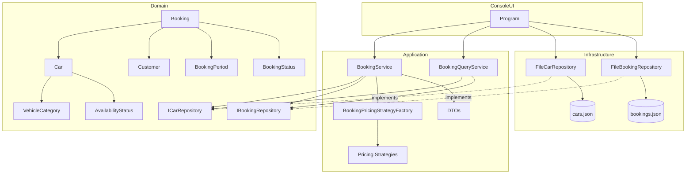

# Діаграма архітектури

```mermaid
flowchart TB
  subgraph UI[ConsoleUI]
    Program[Program]
  end

  subgraph App[Application]
    BookingService[BookingService]
    BookingQueryService[BookingQueryService]
    BookingPricingStrategyFactory[BookingPricingStrategyFactory]
    Strategies[Pricing Strategies]
    DTOs[DTOs]
  end

  subgraph Domain[Domain]
    Car[Car]
    Customer[Customer]
    Booking[Booking]
    BookingPeriod[BookingPeriod]
    ICarRepository[ICarRepository]
    IBookingRepository[IBookingRepository]
    VehicleCategory[VehicleCategory]
    AvailabilityStatus[AvailabilityStatus]
    BookingStatus[BookingStatus]
  end

  subgraph Infra[Infrastructure]
    FileCarRepository[FileCarRepository]
    FileBookingRepository[FileBookingRepository]
    Cars[(cars.json)]
    Bookings[(bookings.json)]
  end

  Program --> BookingService
  Program --> BookingQueryService
  Program --> FileCarRepository
  Program --> FileBookingRepository

  BookingService --> ICarRepository
  BookingService --> IBookingRepository
  BookingService --> BookingPricingStrategyFactory
  BookingService --> DTOs

  BookingQueryService --> ICarRepository
  BookingQueryService --> IBookingRepository

  BookingPricingStrategyFactory --> Strategies

  FileCarRepository -. implements .-> ICarRepository
  FileBookingRepository -. implements .-> IBookingRepository

  FileCarRepository --> Cars
  FileBookingRepository --> Bookings

  Booking --> Car
  Booking --> Customer
  Booking --> BookingPeriod
  Car --> VehicleCategory
  Car --> AvailabilityStatus
  Booking --> BookingStatus
```
