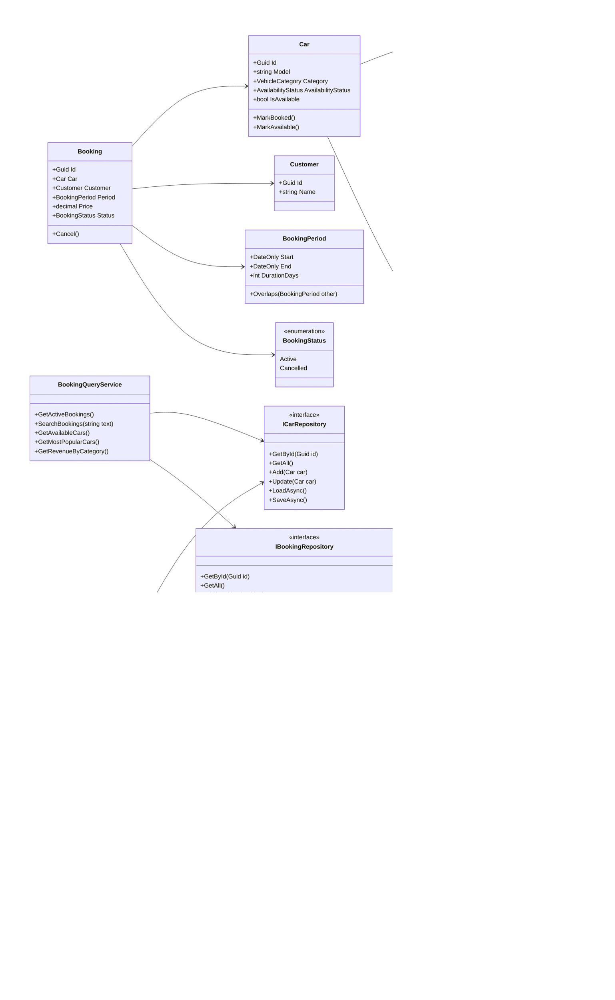

# Діаграма класів

```mermaid
classDiagram
direction LR

class Car {
  +Guid Id
  +string Model
  +VehicleCategory Category
  +AvailabilityStatus AvailabilityStatus
  +bool IsAvailable
  +MarkBooked()
  +MarkAvailable()
}

class Customer {
  +Guid Id
  +string Name
}

class BookingPeriod {
  +DateOnly Start
  +DateOnly End
  +int DurationDays
  +Overlaps(BookingPeriod other)
}

class Booking {
  +Guid Id
  +Car Car
  +Customer Customer
  +BookingPeriod Period
  +decimal Price
  +BookingStatus Status
  +Cancel()
}

class ICarRepository {
  <<interface>>
  +GetById(Guid id)
  +GetAll()
  +Add(Car car)
  +Update(Car car)
  +LoadAsync()
  +SaveAsync()
}

class IBookingRepository {
  <<interface>>
  +GetById(Guid id)
  +GetAll()
  +Add(Booking booking)
  +Update(Booking booking)
  +GetByCar(Guid carId)
  +GetOverlappingAsync(Guid carId, DateOnly start, DateOnly end)
  +LoadAsync()
  +SaveAsync()
}

class BookingService {
  +CreateBookingAsync(BookingRequestDto request)
  +CancelBookingAsync(Guid bookingId)
}

class BookingQueryService {
  +GetActiveBookings()
  +SearchBookings(string text)
  +GetAvailableCars()
  +GetMostPopularCars()
  +GetRevenueByCategory()
}

class BookingPricingStrategyFactory {
  +GetStrategy(VehicleCategory category)
}

class IBookingPricingStrategy {
  <<interface>>
  +CalculatePrice(Car car, BookingPeriod period)
}

class EconomyBookingPricingStrategy
class StandardBookingPricingStrategy
class SuvBookingPricingStrategy

class BookingRequestDto {
  +Guid CarId
  +Guid CustomerId
  +string CustomerName
  +DateTime Start
  +DateTime End
}

class BookingSummaryDto {
  +Guid Id
  +string CarModel
  +VehicleCategory Category
  +string CustomerName
  +DateOnly Start
  +DateOnly End
  +decimal Price
  +BookingStatus Status
}

class CarSummaryDto {
  +Guid Id
  +string Model
  +VehicleCategory Category
  +AvailabilityStatus AvailabilityStatus
  +int BookingCount
}

class VehicleCategory {
  <<enumeration>>
  Economy
  Standard
  SUV
}

class AvailabilityStatus {
  <<enumeration>>
  Available
  Booked
  Unavailable
}

class BookingStatus {
  <<enumeration>>
  Active
  Cancelled
}

Booking --> Car
Booking --> Customer
Booking --> BookingPeriod
Car --> VehicleCategory
Car --> AvailabilityStatus
Booking --> BookingStatus
BookingService --> ICarRepository
BookingService --> IBookingRepository
BookingService --> BookingPricingStrategyFactory
BookingService --> BookingRequestDto
BookingQueryService --> ICarRepository
BookingQueryService --> IBookingRepository
BookingPricingStrategyFactory --> IBookingPricingStrategy
EconomyBookingPricingStrategy ..|> IBookingPricingStrategy
StandardBookingPricingStrategy ..|> IBookingPricingStrategy
SuvBookingPricingStrategy ..|> IBookingPricingStrategy
```

Тут вже видно межу між UI, Application, Domain і Infrastructure, а також місце для Strategy-патерну.
