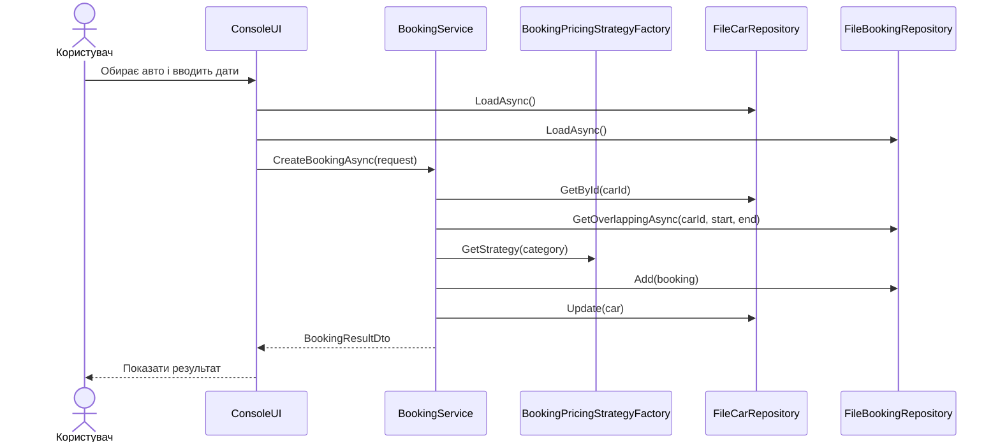

# Діаграма послідовності

```mermaid
sequenceDiagram
actor Користувач
participant ConsoleUI
participant BookingService
participant BookingPricingStrategyFactory
participant FileCarRepository
participant FileBookingRepository

Користувач->>ConsoleUI: Обирає авто і вводить дати
ConsoleUI->>FileCarRepository: LoadAsync()
ConsoleUI->>FileBookingRepository: LoadAsync()
ConsoleUI->>BookingService: CreateBookingAsync(request)
BookingService->>FileCarRepository: GetById(carId)
BookingService->>FileBookingRepository: GetOverlappingAsync(carId, start, end)
BookingService->>BookingPricingStrategyFactory: GetStrategy(category)
BookingService->>FileBookingRepository: Add(booking)
BookingService->>FileCarRepository: Update(car)
BookingService-->>ConsoleUI: BookingResultDto
ConsoleUI-->>Користувач: Показати результат
```

Сценарій показує, як UI не містить бізнес-логіки, а лише збирає ввід і віддає його в сервіс.
